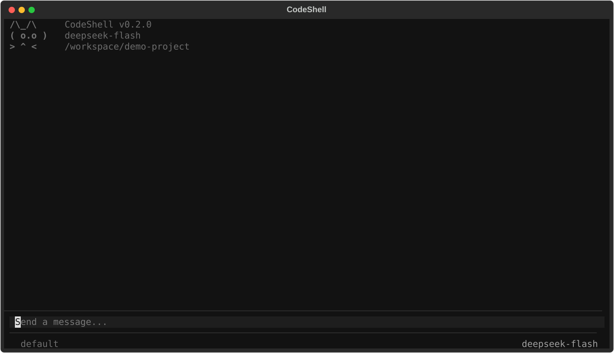
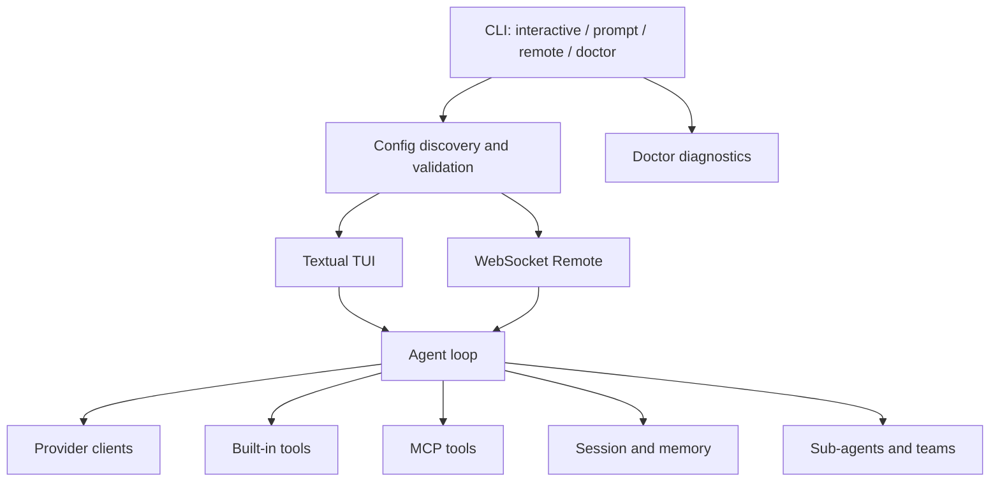

# CodeShell

CodeShell 是一个运行在终端中的 AI 编程助手。它以 Textual 构建交互界面，通过统一的 Provider 层连接 OpenAI Responses、OpenAI-compatible Chat Completions 和 Anthropic API，并提供工具调用、MCP、会话记忆、Skill、多 Agent、Git Worktree 与权限控制能力。



## 核心能力

- 流式对话与 Thinking 内容展示
- 文件读取、搜索、编辑和 Bash 工具调用
- 默认、自动接受编辑、Plan 和绕过权限四种权限模式
- MCP stdio/HTTP 服务接入与延迟工具加载
- 会话保存、恢复、压缩、回退和长期记忆
- 自定义 Slash Command、Agent 和 Skill
- 子 Agent、团队协作与 Git Worktree 隔离
- 终端 TUI、非交互输出和浏览器 Remote 三种使用方式
- `codeshell doctor` 环境、配置、Provider 与 MCP 诊断

## 环境要求

- macOS 或 Linux
- Python 3.11～3.13
- [uv](https://docs.astral.sh/uv/getting-started/installation/)
- 至少一个受支持 Provider 的 API Key
- Node.js 和 npx（仅配置基于 npx 的 MCP 时需要）

## 快速开始

进入克隆后的仓库目录，设置默认 DeepSeek Provider 使用的 Key：

```bash
export OPENAI_API_KEY="your-deepseek-api-key"
```

随后只需一条命令完成锁定依赖同步、非 editable 安装和启动：

```bash
uv run --locked --no-editable codeshell
```

不需要手动创建或激活 `.venv`。首次运行且没有用户配置时，CodeShell 会只读使用仓库根目录的 `config.example.yaml`；该文件不保存密钥。

启动前可先执行离线环境检查：

```bash
uv run --locked --no-editable codeshell doctor --offline
```

需要验证 API Key、网络和模型是否可用时执行在线检查：

```bash
uv run --locked --no-editable codeshell doctor
```

在线 Doctor 只访问 Provider 的模型元数据接口，不发送对话请求。

## 配置

配置按以下顺序加载，后层覆盖前层：

1. `~/.codeshell/config.yaml`
2. `<项目目录>/.codeshell/config.yaml`
3. `<项目目录>/.codeshell/config.local.yaml`

当三处均不存在时，仓库根目录的 `config.example.yaml` 才作为只读默认值使用。自定义配置可以从示例复制：

```bash
mkdir -p .codeshell
cp config.yaml .codeshell/config.yaml
```

`.codeshell/` 已被 Git 忽略，适合保存本地配置；仍建议通过环境变量提供 Key，避免密钥落盘。

### DeepSeek Responses API

```yaml
providers:
  - name: deepseek-official
    protocol: openai
    base_url: https://api.deepseek.com
    model: deepseek-flash
    models:
      - deepseek-flash
      - deepseek-v4-pro
    api_key: ""
    thinking: true
    context_window: 1000000
```

`model` 是启动时使用的默认模型，`models` 是 TUI 运行期间允许切换的候选模型。使用环境变量 `OPENAI_API_KEY`。

### OpenAI Responses API

```yaml
providers:
  - name: openai
    protocol: openai
    base_url: https://api.openai.com/v1
    model: gpt-4.1
    api_key: ""
```

使用环境变量 `OPENAI_API_KEY`。

### Anthropic API

```yaml
providers:
  - name: anthropic
    protocol: anthropic
    base_url: https://api.anthropic.com
    model: claude-sonnet-4-6
    api_key: ""
```

使用环境变量 `ANTHROPIC_API_KEY`。

### OpenAI-compatible Chat Completions

适用于 Ollama、vLLM、Together 等提供 `/chat/completions` 的服务：

```yaml
providers:
  - name: local-ollama
    protocol: openai-compat
    base_url: http://localhost:11434/v1
    model: qwen3-coder
    api_key: ""
```

该协议也读取 `OPENAI_API_KEY`；本地服务若不校验 Key，可设置一个非空占位值。

### MCP

stdio MCP 示例：

```yaml
mcp_servers:
  - name: context7
    command: npx
    args: ["-y", "@upstash/context7-mcp"]
```

HTTP MCP 示例：

```yaml
mcp_servers:
  - name: remote-tools
    url: https://example.com/mcp
    headers:
      Authorization: "Bearer ${MCP_TOKEN}"
```

stdio 子进程只继承 `PATH` 和配置中显式声明的环境变量，避免把宿主机密钥整体传给第三方服务。

## 使用方式

### 终端交互

```bash
uv run --locked --no-editable codeshell
```

常用快捷键：

| 快捷键 | 作用 |
|---|---|
| `Enter` | 发送消息 |
| `Shift+Enter` / `Ctrl+J` | 输入换行 |
| `Tab` | 命令或文件补全 |
| `Esc` | 取消当前操作 |
| `Shift+Tab` | 切换权限模式 |
| `Ctrl+O` | 展开/折叠工具调用 |
| `Ctrl+C` | 退出 |

内置命令包括 `/help`、`/status`、`/model`、`/plan`、`/compact`、`/session`、`/memory`、`/mcp`、`/sandbox`、`/rewind`、`/skill`、`/tasks`、`/trace` 和 `/worktree`。输入 `/help <命令名>` 查看具体用法。

在 TUI 会话中输入 `/model` 可打开模型列表，也可以直接切换：

```text
/model deepseek-flash
/model deepseek-v4-pro
```

模型切换只对当前运行生效，不会写回配置；重启后仍使用 `model` 指定的默认值。当前回复正在生成时，CodeShell 会拒绝切换并提示等待。此功能仅支持上面两个 DeepSeek 模型。

### 非交互调用

```bash
uv run --locked --no-editable codeshell -p "分析当前项目结构"
```

输出 NDJSON 事件流：

```bash
uv run --locked --no-editable codeshell \
  -p "检查测试失败原因" \
  --output-format stream-json
```

非交互调用会实际请求模型并产生相应费用。

### Remote 模式

```bash
uv run --locked --no-editable codeshell --remote
```

然后访问 `http://localhost:18888`。Remote 服务默认监听 `0.0.0.0:18888`；在共享网络中使用前应额外配置网络访问控制。

## Doctor 输出

Doctor 的每一项检查都有独立状态：

- `PASS`：检查通过。
- `WARN`：可选能力不可用，或因 `--offline` 主动跳过联网检查。
- `FAIL`：关键配置、运行时或 Provider 检查失败。

关键失败会令命令返回退出码 `1`；只有 PASS/WARN 时返回 `0`。Doctor 不显示完整 API Key，也不会自动修改配置。

## 架构



主要目录：

```text
codeshell/
├── agent.py          Agent 事件循环与工具调度
├── app.py            Textual 终端界面
├── client.py         Anthropic/OpenAI Provider 适配
├── config.py         配置发现、合并与校验
├── doctor.py         环境和连接诊断
├── commands/         Slash Command 框架
├── mcp/              MCP 生命周期与工具封装
├── memory/           会话、记忆与上下文管理
├── permissions/      权限规则与危险命令检测
├── skills/           Skill 加载与执行
├── teams/            多 Agent 团队协调
├── tools/            内建工具
└── worktree/         Git Worktree 隔离
```

## 开发与测试

开发时可以使用模块入口，让源码修改立即生效：

```bash
uv sync --locked
uv run python -m codeshell
```

运行新增的交付测试：

```bash
uv run python -m pytest -q \
  tests/test_config.py tests/test_doctor.py tests/test_cli.py
```

运行完整测试：

```bash
uv run python -m pytest -q
```

本次改造前的基线为 `701 passed, 1 skipped, 1 failed`；改造后的本地完整回归为 `738 passed, 1 skipped, 1 failed`。新增的 37 项交付测试全部通过，失败仍位于危险命令 Hook 集成测试；本轮按已批准边界不修改该功能，CI 会保留完整回归结果而不会静默过滤。

## 常见问题

### `ModuleNotFoundError: No module named 'codeshell'`

部分 macOS/Python 3.13 环境会忽略 editable 安装生成的隐藏 `.pth` 文件。使用正式非 editable 启动命令：

```bash
uv run --locked --no-editable codeshell
```

开发模式也可以使用：

```bash
uv run python -m codeshell
```

### 找不到配置文件

确认当前目录是仓库根目录，或将配置保存到 `.codeshell/config.yaml`。执行以下命令查看搜索位置：

```bash
uv run --locked --no-editable codeshell doctor --offline
```

### API Key 已设置但仍认证失败

- `anthropic` 协议读取 `ANTHROPIC_API_KEY`。
- `openai` 和 `openai-compat` 读取 `OPENAI_API_KEY`。
- 配置文件内非空的 `api_key` 优先于环境变量。

执行在线 Doctor 区分认证失败、网络失败和模型不存在。

### MCP 一直显示连接中

先运行 Doctor 检查 MCP 命令。使用 npx MCP 时确认：

```bash
node --version
npx --version
```

不需要 MCP 时，从本地配置中移除 `mcp_servers`。

## 安全说明

- 保持 `permission_mode: default`，让文件写入和危险命令经过确认。
- `bypassPermissions` 会跳过交互授权，只应在额外隔离的受控环境使用。
- OS 沙箱是否生效取决于系统支持和 `sandbox` 配置。
- MCP Server 是独立外部进程或服务，应只连接可信来源。
- 不要提交 `.codeshell/config.yaml`、权限本地规则、会话日志或任何真实密钥。

本项目的每次独立改进都保存在 `docs/improvements/<topic>/`，包含需求、设计、任务、验收和最终变更报告，便于审阅和复盘。
