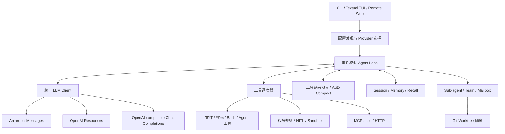

# CodeShell 项目技术亮点与简历写作指南

> 文档日期：2026-09-15  
> 项目版本：0.2.0  
> 用途：简历项目描述、项目介绍、面试复盘与代码导读

## 1. 使用边界与推荐表述

这份文档将内容分成两类：

1. **项目现有能力**：根据当前仓库代码和测试整理，可以用来介绍项目架构，但不等同于个人原创。
2. **本人已完成的改进**：本轮实际完成并验证的仓库一键启动、配置发现、Doctor、CLI、文档、构建和 CI 改造，可以作为个人贡献重点描述。

当前目录不包含可用的 Git 提交历史。因此，简历中建议使用“参与维护”“负责交付改造”“基于现有架构完善”等准确说法，不建议在无法证明的情况下写“从零独立设计整个 Agent 框架”。

## 2. 项目一句话定位

CodeShell 是一个使用 Python、asyncio 与 Textual 构建的终端 AI 编程 Agent。它通过统一协议层接入多种大模型，围绕 Agent 循环组织流式生成、工具调用、权限确认、上下文压缩、会话记忆、MCP、多 Agent 协作和 Git Worktree 隔离，并同时提供 TUI、非交互 CLI 与浏览器 Remote 三种使用入口。

适合放在简历中的短描述：

> 面向真实代码仓库的终端 AI 编程 Agent，支持多模型协议、流式工具调用、MCP、上下文治理、持久化记忆、权限控制、多 Agent 协作与 Git Worktree 隔离。

## 3. 技术栈

| 分类 | 技术与组件 | 在项目中的作用 |
|---|---|---|
| 语言与运行时 | Python 3.11～3.13、asyncio | Agent 主循环、流式处理、并发工具执行和异步服务生命周期 |
| 终端界面 | Textual | 交互式 TUI、流式内容展示、权限确认和命令交互 |
| 模型 SDK | Anthropic SDK、OpenAI SDK | Anthropic Messages、OpenAI Responses 和兼容 Chat Completions 接入 |
| 数据模型 | Pydantic、dataclass | 配置校验、事件模型、会话和工具数据结构 |
| Agent 工具协议 | MCP | stdio/HTTP 外部工具接入、Schema 转换与延迟加载 |
| 网络通信 | HTTPX、WebSockets | Provider 元数据探测、Remote HTTP/WebSocket 服务 |
| 配置与存储 | YAML、JSONL、Markdown | 配置分层、会话日志、长期记忆和权限规则 |
| 代码隔离 | Git Worktree | 为并行 Agent 创建独立分支与工作目录 |
| 工程化 | uv、Hatchling、pytest、GitHub Actions | 锁定依赖、构建分发、回归测试和多 Python 版本交付验证 |

依赖与命令入口可见 [pyproject.toml](../../../pyproject.toml)。

## 4. 总体架构



一条典型请求的执行链如下：

1. CLI、TUI 或 Remote 接收用户请求。
2. `ConversationManager` 组织跨 Provider 的中立消息结构。
3. `LLMClient` 将消息序列化为目标 Provider 协议，并把流式响应归一化为统一事件。
4. Agent 收集文本、Thinking 和工具调用事件。
5. 工具执行前经过 Hook、权限规则、危险命令和路径沙箱检查。
6. 调度器依据工具及参数判断能否并发，读操作可并发，有副作用操作保持模型给出的顺序。
7. 工具结果按预算进入对话；超大结果落盘，长会话接近窗口上限时触发摘要压缩。
8. 完整过程写入会话，必要时执行记忆召回、文件回退或多 Agent 协作。

核心入口可从 [agent.py](../../../codeshell/agent.py)、[client.py](../../../codeshell/client.py) 和 [conversation.py](../../../codeshell/conversation.py) 开始阅读。

## 5. 核心技术亮点

### 5.1 多 Provider 统一抽象，隔离协议差异

#### 要解决的问题

Anthropic Messages、OpenAI Responses 和 OpenAI-compatible Chat Completions 在消息格式、Thinking、工具调用增量、缓存字段和异常类型上并不一致。如果业务层直接依赖某个 SDK，切换模型时会把协议差异扩散到 Agent、UI、会话和工具系统。

#### 项目实现

- 抽象 `LLMClient` 异步流式接口，由 `AnthropicClient`、`OpenAIClient` 和 `OpenAICompatClient` 分别实现。
- 使用 Provider-neutral 的 `TextDelta`、`ThinkingDelta`、`ToolCallComplete`、`StreamEnd` 等事件，让 Agent 只处理统一语义。
- 在序列化层把内部 `Message` 分别转换成 Anthropic、OpenAI Responses 和 Chat Completions 消息格式。
- 统一鉴权、限流、网络和 HTTP 状态异常，减少上层分支判断。
- 对中断后的历史执行 tool-use/tool-result 配对修复，避免孤立工具块导致下一次 Provider 请求直接失败。

#### 工程价值

- Provider 切换集中在配置和适配层，核心 Agent 逻辑基本不变。
- TUI、CLI、Remote 和 Session 可以复用同一种事件与消息模型。
- 新增兼容 Provider 时主要实现协议适配，不需要重写工具编排。

#### 代码证据

- [client.py](../../../codeshell/client.py)
- [serialization.py](../../../codeshell/serialization.py)
- [conversation_pairing.py](../../../codeshell/conversation_pairing.py)

#### 面试讲法

> 我把模型 SDK 看成基础设施适配器，Agent 只依赖统一的流事件和中立消息结构。这样协议差异被限制在客户端与序列化层，模型替换不会向工具调度、会话和 UI 扩散。

### 5.2 事件驱动 Agent Loop，统一流式输出与工具生命周期

#### 要解决的问题

编程 Agent 的一次响应不只有文本，还可能包含 Thinking、多个工具调用、权限请求、重试、压缩通知、用量统计和错误。如果 UI 直接读取某个 SDK 的原始流，业务状态会和展示逻辑紧耦合。

#### 项目实现

- 定义 `StreamText`、`ThinkingText`、`ToolUseEvent`、`ToolResultEvent`、`PermissionRequest`、`CompactNotification`、`UsageEvent`、`RetryEvent` 等事件联合类型。
- `StreamCollector` 一边把 Provider 流转换成 Agent 事件，一边累积完整响应。
- Agent 通过异步生成器向调用端持续产出事件，而不是等待整轮结束后一次返回。
- TUI、非交互 NDJSON 和 Remote WebSocket 都消费同一套 Agent 事件。
- 单个工具失败被包装成带 `tool_id` 的错误结果，不直接中断整批工具，保证下一轮消息仍满足 Provider 的配对约束。

#### 工程价值

- 首 token 到达后即可展示，用户不用等待整轮完成。
- 前端入口与模型 SDK 解耦，新增展示端无需复制 Agent 状态机。
- 权限、取消、重试和上下文压缩都能作为明确事件被观察和记录。

#### 代码证据

- [agent.py](../../../codeshell/agent.py)
- [app.py](../../../codeshell/app.py)
- [remote.py](../../../codeshell/remote.py)
- [__main__.py](../../../codeshell/__main__.py)

### 5.3 基于副作用和实际参数的安全并发调度

#### 要解决的问题

完全串行执行多个只读工具会浪费 I/O 等待时间；全部并发又可能破坏写操作的依赖顺序。例如两个文件编辑可能修改同一文件，`WriteFile` 后的 Bash 也可能依赖刚写入的内容。

#### 项目实现

- `partition_tool_calls()` 按相邻关系把工具调用切分成并发批和串行批。
- 并发安全性由工具结合本次参数动态判断，而不是只看工具类别。
- `ReadFile`、搜索和安全只读 Bash 命令可以组成并发批。
- `rm`、`mv`、安装命令、写文件等有副作用操作独占串行批。
- 安全批通过 `asyncio.gather(..., return_exceptions=True)` 并发执行，同时按模型调用顺序回收结果。

#### 工程价值

这是“性能与正确性”之间的折中：加速无副作用 I/O，同时保留有状态操作的确定性和可复现性。

#### 代码证据

- [agent.py](../../../codeshell/agent.py)
- [tools/base.py](../../../codeshell/tools/base.py)
- [tools/bash.py](../../../codeshell/tools/bash.py)

#### 面试追问建议

如果被问到“为什么不收到工具调用就立刻执行”，可以回答：完整收集后才能知道相邻调用之间是否存在写后读或写写依赖；过早执行等价于默认全部并发，会改变模型规划的顺序语义。

### 5.4 双层上下文治理，处理大工具输出和长对话

#### 要解决的问题

Agent 很容易因为日志、搜索结果和大文件读取撑爆上下文窗口。仅做对话摘要不够，因为一轮并发工具结果就可能在进入历史前超过预算；仅截断工具结果也不够，因为长对话仍会累积。

#### 项目实现

第一层处理工具结果：

- 单条工具输出进入历史前有字符上限。
- 同一轮多个结果还有 200,000 字符的聚合预算。
- 超预算时优先把最大的结果持久化到会话隔离目录，只把路径和前 2 KB 预览放入上下文。
- 模型主动回读已落盘内容时不再次溢写，避免“回读—再落盘”的死循环。

第二层处理完整对话：

- 根据模型上下文窗口动态计算压缩阈值。
- 自动压缩在有效窗口前保留 13,000 token 安全边距；硬触发使用 3,000 token 边距。
- 压缩时保留近期原文，目标为最近约 10,000 token、至少 5 条消息，并设置 40,000 token 上限。
- 只摘要较早前缀，保留近期工具交互和细节；压缩边界持久化到 Session，恢复后仍可重建。
- 连续压缩失败使用熔断保护，避免每轮都重复消耗模型请求。
- 压缩后的恢复附件会重新带回最近文件读取、已启用 Skill、工具和 transcript 路径等关键工作状态。

#### 工程价值

- 控制长任务的 token 和失败风险。
- 大输出完整保存在磁盘，需要时仍可精确回读，而不是不可逆截断。
- 保留近期原文能降低摘要丢失当前实现细节的概率。

#### 代码证据

- [context/manager.py](../../../codeshell/context/manager.py)
- [conversation.py](../../../codeshell/conversation.py)
- [tools/base.py](../../../codeshell/tools/base.py)

### 5.5 Prompt Cache 与 MCP Schema 的自适应加载

#### 要解决的问题

MCP 服务可能暴露大量工具 Schema。全量注入会占用上下文；会话中途改变 tools 数组还可能让历史 Prompt Cache 失效。另一方面，所有场景都强制延迟加载也会增加额外的工具检索轮次。

#### 项目实现

- 根据 MCP Schema 估算 token，占上下文窗口低于 10% 时选择 `eager`，直接加载全部工具。
- 官方 Anthropic 端点使用原生 `defer_loading` 与 `tool_reference`。
- 不支持原生延迟工具的兼容端点使用 `dispatch`，MCP Schema 不进入 tools 数组，通过统一 `mcp_call` 分发。
- 会话开始时确定模式，并保持工具数组稳定，避免反复破坏缓存前缀。
- Anthropic 客户端为 system、工具定义和用户尾部设置缓存断点，并归一化记录 cache read/create 用量。

#### 工程价值

- 小工具集优先简单性，大工具集优先节省上下文。
- 对不同 Provider 能力做渐进增强，而不是把官方私有特性强行发送给兼容网关。
- 通过稳定工具集合提高 Prompt Cache 可复用性。

#### 证据边界

代码注释记录过“20,000 token 历史中新增工具后缓存命中率从 99.4% 降到 9.5%”的内部实验，但本轮没有独立复现实验。简历中可以描述缓存失效问题和加载策略，不应把这组数据写成自己测得的线上收益。

#### 代码证据

- [mcp/loading_strategy.py](../../../codeshell/mcp/loading_strategy.py)
- [mcp/manager.py](../../../codeshell/mcp/manager.py)
- [mcp/client.py](../../../codeshell/mcp/client.py)
- [client.py](../../../codeshell/client.py)

### 5.6 分层权限控制与 Human-in-the-loop

#### 要解决的问题

编程 Agent 能读写文件和执行 shell，单一“允许/拒绝”开关无法同时满足效率与安全。安全判断还要覆盖权限模式、危险命令、文件边界、项目规则和人工确认。

#### 项目实现

权限检查按层执行：

1. Plan 模式只放行规划所需工具和计划文件写入。
2. 安全只读命令自动放行。
3. Bash 危险命令命中黑名单时拒绝。
4. 启用 OS 沙箱时，复合命令逐段检查 deny/ask 规则后再决定自动放行。
5. 文件工具经过路径沙箱和受保护文件检查。
6. 用户级、项目级、本地级规则按 `deny > ask > allow` 决策。
7. 最后根据 `default`、`acceptEdits`、`plan`、`bypassPermissions` 四种模式兜底，必要时发出 `PermissionRequest` 等待人工决定。

规则缓存结合文件修改时间和大小判断是否热加载，避免每次工具调用都重复解析，同时允许用户修改规则后生效。

#### 工程价值

- 对只读操作减少无意义确认，对写入和外部副作用保留控制权。
- 权限理由作为结构化结果返回，UI 能解释“为什么允许、询问或拒绝”。
- 用户拒绝工具时可以附带反馈，让模型换一种方案继续，而不是直接结束任务。

#### 代码证据

- [permissions/checker.py](../../../codeshell/permissions/checker.py)
- [permissions/rules.py](../../../codeshell/permissions/rules.py)
- [permissions/dangerous.py](../../../codeshell/permissions/dangerous.py)
- [permissions/sandbox.py](../../../codeshell/permissions/sandbox.py)

#### 已知边界

完整回归中仍有一项 Hook 拒绝与危险 Bash 执行顺序相关的集成测试失败。本轮没有修改该安全路径，因此简历中不应写“彻底杜绝所有危险命令”，应写“实现/集成分层权限控制并保留已知 Hook 边界”。

### 5.7 会话、长期记忆、召回与文件回退

#### 要解决的问题

一次性对话无法支撑长期开发。Agent 既要在会话中断后恢复模型上下文，也要记住跨会话的用户习惯和项目经验，还要允许用户回退 Agent 对文件造成的变更。

#### 项目实现

- Session 使用追加式 JSONL 保存 Provider-neutral 消息，损坏或旧格式行不会让整个会话无法恢复。
- Compact boundary 同时保存摘要和近期原文，恢复后再执行工具配对修复。
- 自动记忆以独立 Markdown 文件和 frontmatter 存储，`MEMORY.md` 只作为索引。
- `user/feedback` 记忆进入用户级目录，`project/reference` 进入项目级目录。
- 召回器先扫描元数据，再让模型最多选择 5 条相关记忆，避免把整个记忆库塞入系统提示。
- 记忆索引限制为 200 行、25 KB，超限时截断并给出维护警告。
- 记忆预取可与主 LLM 请求并行，相关内容在工具执行后的合适时机注入。
- FileHistory 在修改前保存文件快照，可按会话时间点恢复已修改文件，并删除目标时间点之后新建的文件。

#### 工程价值

- 将“短期对话状态”“长期知识”和“文件版本”拆成不同生命周期，职责更清晰。
- 文件式存储可读、可审计、便于 Git 管理，也比不透明向量库更容易调试。
- 先做候选过滤再做模型选择，控制召回成本和上下文占用。

#### 代码证据

- [memory/session.py](../../../codeshell/memory/session.py)
- [memory/auto_memory.py](../../../codeshell/memory/auto_memory.py)
- [memory/recall.py](../../../codeshell/memory/recall.py)
- [filehistory/history.py](../../../codeshell/filehistory/history.py)

### 5.8 多 Agent 团队协作与 Git Worktree 隔离

#### 要解决的问题

多个 Agent 在同一个工作目录并发修改代码会产生文件覆盖、分支污染和结果难以归属等问题；只实现“启动子进程”也不足以管理任务、消息和生命周期。

#### 项目实现

- Team 层支持 in-process、tmux 和 iTerm2 等执行后端。
- 使用共享任务存储和持久化 Mailbox 传递文本、关闭请求、计划审批请求与响应。
- Lead Agent 可接收成员消息、跟踪空闲状态并统一清理团队资源。
- Worktree Manager 为 Agent 创建独立分支与目录，并使用异步锁避免并发创建竞争。
- 创建后可执行目录软链接等初始化步骤。
- 快速恢复时直接读取 `.git`、`HEAD` 和 `packed-refs`，减少启动 Git 子进程。
- 删除前检查未提交修改和新增提交，除非显式允许丢弃，否则拒绝清理有价值的工作。
- Worktree Session 可持久化和恢复。

#### 工程价值

- 从文件系统层隔离并行 Agent 的写操作，而不是只依赖提示词约束。
- 成员消息、任务状态和代码目录都有明确归属，便于协调与回收。
- 清理保护降低自动化流程误删 Agent 工作成果的风险。

#### 代码证据

- [teams/manager.py](../../../codeshell/teams/manager.py)
- [teams/models.py](../../../codeshell/teams/models.py)
- [teams/coordinator.py](../../../codeshell/teams/coordinator.py)
- [worktree/manager.py](../../../codeshell/worktree/manager.py)

### 5.9 一套核心事件，多种交互入口

项目同时提供：

- Textual TUI：面向日常交互式开发。
- Prompt CLI：适合脚本调用，并能输出 NDJSON 事件流。
- Remote：通过同一进程提供嵌入式网页和 WebSocket 通信。

Remote 将 Agent 的文本、Thinking、工具、权限、用量、压缩、重试和 Hook 事件映射为 JSON 消息，支持多客户端广播、取消信号与异步权限响应。这个设计说明前端不是 Agent 的控制中心，而是统一事件模型的不同消费者。

代码证据：

- [app.py](../../../codeshell/app.py)
- [__main__.py](../../../codeshell/__main__.py)
- [remote.py](../../../codeshell/remote.py)
- [web_content.py](../../../codeshell/web_content.py)

### 5.10 可诊断、可构建、可验证的交付工程

这是本轮最适合明确写成个人贡献的技术亮点，详见下一节。

改造把“开发者机器上能运行”提升为“新用户可以按唯一命令安装、启动、诊断并复现验证”：

- 锁定依赖并采用非 editable 安装，提前发现打包后缺文件、入口失效等问题。
- 安全示例配置不保存密钥，缺少用户配置时只读回退。
- Doctor 将 Python、仓库、配置、API Key、Provider 和 MCP 检查统一为 PASS/WARN/FAIL，并用退出码支持脚本化。
- GitHub Actions 覆盖 Python 3.11、3.12、3.13 的安装、测试、构建和入口 smoke test。
- README 给出唯一正式启动命令、配置优先级、Provider 示例、真实 TUI 截图与排障说明。

代码证据：

- [config.py](../../../codeshell/config.py)
- [doctor.py](../../../codeshell/doctor.py)
- [__main__.py](../../../codeshell/__main__.py)
- [ci.yml](../../../.github/workflows/ci.yml)
- [README.md](../../../README.md)
- [一键启动改造报告](../repository-one-click-startup/change-report.md)

## 6. 本人可明确认领的改进

下面内容有完整的实现和验收记录，是简历中最稳妥的“个人工作”部分。

### 6.1 仓库一键安装与启动

将正式使用路径收敛为：

```bash
uv run --locked --no-editable codeshell
```

这一条命令会基于锁文件创建/复用虚拟环境、执行非 editable 安装并启动 TUI，不要求用户手动创建或激活 `.venv`。

实际在排除 `.venv`、本地配置和构建产物的干净副本中验证：首次运行完成环境创建、项目构建、53 个依赖包安装并打开真实 TUI；第二次运行能够复用环境继续启动。

### 6.2 配置发现与安全默认值

- 新增不含真实密钥的 `config.example.yaml`。
- 保留用户级、项目级、本地级三层覆盖顺序。
- 仅在三层配置都不存在时只读使用示例配置，不静默修改用户文件。
- 配置缺失、不可读、YAML 损坏和字段校验失败时返回包含路径与修复动作的错误。
- 默认关闭依赖 Node.js 的 MCP，避免首次启动被非核心组件阻断。

### 6.3 `codeshell doctor` 诊断命令

- 新增 `codeshell doctor [--offline]`。
- 检查 Python、仓库、配置、API Key、Provider 与 MCP。
- 每项检查输出 PASS/WARN/FAIL；关键失败返回退出码 1。
- 在线检查只读取 Provider 模型元数据，不发送对话请求。
- 输出不展示完整 API Key，检查过程不修改配置。
- 当前 DeepSeek 实际在线验证结果为 8 PASS、0 WARN、0 FAIL。

### 6.4 CLI、版本与打包一致性

- 拆分 CLI 参数构建和执行逻辑，增加 `--version` 与 Doctor 路由。
- CLI、TUI Banner 和 `/status` 统一从包元数据读取版本。
- 补充 README 包元数据，使 wheel/sdist 描述完整。
- 成功构建 `codeshell-0.2.0` wheel 和 sdist，并在独立 Python 3.13 环境验证安装后的 `--help`、`--version`、离线 Doctor 入口。

### 6.5 文档、测试与 CI

- 重写 README，覆盖启动、配置、多 Provider、MCP、使用模式、Doctor、安全边界和排障。
- 使用 Textual 实际运行结果生成界面截图，而非手绘效果图。
- 新增 37 项配置、Doctor 和 CLI 交付测试，全部通过。
- 建立 Python 3.11～3.13 的 GitHub Actions 交付矩阵。
- 完整回归结果为 738 passed、1 skipped、1 failed；唯一失败为改造前已经存在且明确不在本轮范围内的 Hook 集成问题，没有隐藏或过滤失败。

完整逐文件记录见 [repository-one-click-startup/change-report.md](../repository-one-click-startup/change-report.md)。

## 7. 可直接复制到简历的项目描述

### 7.1 推荐版：准确突出个人贡献

**CodeShell｜终端 AI 编程 Agent｜Python / asyncio / Textual / MCP / OpenAI / Anthropic**

项目简介：面向代码仓库的终端 AI 编程 Agent，支持多模型协议、流式工具调用、上下文压缩、持久化记忆、权限控制、MCP、多 Agent 协作与 Git Worktree 隔离。

个人工作：

- 负责仓库交付工程化改造，基于 `uv` 锁定依赖并设计非 editable 一键启动流程，使新克隆仓库可通过单条命令完成环境创建、依赖安装和 TUI 启动；在干净副本中完成首次及重复启动验证。
- 设计并实现分层配置发现与 `codeshell doctor` 自检命令，覆盖 Python、配置、密钥、Provider、模型元数据和 MCP，提供 PASS/WARN/FAIL 结果及自动化退出码，并确保诊断过程不泄露密钥、不修改配置。
- 重构 CLI 路由并统一包版本来源，打通 wheel/sdist 构建、隔离环境安装和安装后命令入口，解决源码可运行但分发包路径不可靠的问题。
- 补齐 Python 3.11～3.13 CI 交付矩阵、README、真实 TUI 截图与 37 项自动化测试；本地完整回归达到 738 passed，新增交付测试全部通过且未引入新增失败。

### 7.2 精简版：简历空间有限时使用

**CodeShell｜Python 终端 AI 编程 Agent**

- 参与维护集多模型适配、MCP、工具调用、上下文压缩、长期记忆、多 Agent 与 Worktree 隔离于一体的异步编程 Agent。
- 负责基于 `uv` 的一键交付改造，实现安全配置回退、Doctor 自检、统一 CLI/版本和非 editable 安装，完成干净副本端到端启动验证。
- 建立 Python 3.11～3.13 CI 与 37 项交付测试，完成 wheel/sdist 隔离安装验证；完整回归 738 passed，未新增失败。

### 7.3 Agent/后端岗位强化版

以下表述只有在能够独立解释第 5 节代码和设计取舍时再使用：

- 基于 Provider-neutral 事件模型梳理 Anthropic Messages、OpenAI Responses 和兼容 Chat Completions 的协议差异，使 Agent Loop、Session、TUI 与 Remote 复用统一流式接口。
- 分析并维护工具调度策略，按调用参数识别副作用，对只读工具并发执行、写操作串行执行，在降低 I/O 等待的同时保持模型规划顺序。
- 梳理双层上下文治理机制，通过大工具结果落盘预览、动态阈值压缩、近期原文保留和失败熔断支持长任务恢复。
- 梳理 MCP Schema 自适应加载策略，依据上下文占用和 Provider 能力选择 eager、native 或 dispatch 模式，控制工具 Schema 的 token 开销和缓存失效风险。

注意：这里推荐使用“梳理、维护、分析”，除非后续确实对相应模块做过实质修改并补充测试，再升级成“设计并实现”。

## 8. 面试项目介绍

### 8.1 30 秒版本

> CodeShell 是一个 Python 编写的终端 AI 编程 Agent。它不是简单调用模型 API，而是用统一事件层兼容三类模型协议，再通过 Agent Loop 完成流式输出、工具调度、权限确认、上下文压缩和会话记忆。项目还接入了 MCP、多 Agent 和 Git Worktree。我主要负责仓库交付体验改造，把启动路径收敛成一条 uv 命令，并实现配置发现、Doctor 诊断、打包验证、CI 和交付测试，让新克隆仓库可以稳定安装、启动和排障。

### 8.2 两分钟版本

> 这个项目的核心挑战有三层。第一层是模型协议差异：Anthropic、OpenAI Responses 和兼容 Chat Completions 的消息和工具流不同，所以项目通过 Provider-neutral 的流事件把差异限制在 Client 和 Serialization 层。第二层是 Agent 执行正确性：模型可能一次返回多个工具调用，项目会按实际参数判断副作用，只读操作并发，写操作串行，同时把权限、Hook、工具结果和错误统一成事件。第三层是长任务稳定性：超大工具输出先落盘并保留预览，完整对话接近上下文上限时只摘要旧前缀、保留近期原文，并把边界持久化到 Session。
>
> 我重点完成的是交付链路。我先把新用户启动依赖收敛为安全示例配置和唯一 uv 命令，再增加 Doctor，把环境、配置、API Key、Provider 和 MCP 问题变成可观察的 PASS/WARN/FAIL。之后统一 CLI 和版本来源，验证 wheel/sdist 的隔离安装，并建立 Python 3.11 到 3.13 的 CI smoke test。最终在干净副本中验证了首次安装和重复启动，新增 37 项测试全部通过；完整回归的已知 Hook 失败也保留并公开，没有通过过滤测试掩盖问题。

## 9. 两个可重点准备的 STAR 案例

### 9.1 案例一：把“源码能跑”改造成“克隆后一键启动”

**Situation**：项目功能丰富，但缺少安全默认配置、统一启动命令、安装后入口验证和完整的新手文档，新用户容易卡在环境、配置或打包差异上。

**Task**：在不改变 Agent 核心行为、不写入真实密钥的前提下，让仓库在 macOS/Linux、Python 3.11～3.13 环境具备可复现的一键启动路径。

**Action**：

- 分析启动依赖、配置优先级、CLI 入口和包元数据。
- 选择 `uv run --locked --no-editable codeshell` 作为唯一正式命令。
- 增加安全示例配置和只读回退，默认关闭非核心 MCP。
- 统一版本来源，补充 README 元数据，构建 wheel/sdist 并在隔离环境测试。
- 在排除虚拟环境和本地状态的干净副本中做首次、重复启动验收。

**Result**：一条命令完成虚拟环境创建、项目构建、53 个包安装和 TUI 启动；第二次执行复用环境成功；交付测试 37 项全部通过。

### 9.2 案例二：设计不泄密、可自动化的 Doctor

**Situation**：模型项目的失败来源很多，包括 Python 版本、配置路径、环境变量、网络、模型名称和 MCP 命令。直接启动失败时，用户难以区分是哪一层问题。

**Task**：提供统一、只读、对人和 CI 都友好的诊断入口。

**Action**：

- 将检查结果建模为 PASS/WARN/FAIL，并汇总成确定性退出码。
- 支持 `--offline`，区分本地配置验证和在线 Provider 探测。
- 在线只读取模型元数据，不发送对话请求。
- 对鉴权、网络、模型不存在和 MCP 缺失进行分类提示。
- 测试输出脱敏、重复执行不改配置，并覆盖 OpenAI SDK 分页对象等真实返回形态。

**Result**：新增 19 项 Doctor 单测；当前配置在线检查 8 PASS、0 WARN、0 FAIL；命令可直接用于用户排障和 CI smoke test。

## 10. 高频面试问题与回答要点

### Q1：为什么使用统一事件，而不是直接透传 SDK 数据？

不同 SDK 的流事件和字段并不兼容。统一事件能让 Agent 只关心文本、Thinking、工具调用和用量等业务语义；TUI、Remote 和 Session 也不需要了解 Provider 细节。代价是适配层需要维护完整映射和 Provider 特例。

### Q2：工具并发如何保证正确性？

不是按“工具名称”粗粒度判断，而是由工具结合本次参数返回并发安全性。连续的安全调用组成并发批，通过 `asyncio.gather` 执行；有副作用的调用单独串行。最终结果仍按模型调用顺序写回，单个失败也保留对应 `tool_id`。

### Q3：为什么大结果落盘后还要做 Auto Compact？

两者解决不同问题。落盘限制单轮工具结果，Auto Compact 控制多轮历史累积。只做其中一层都无法覆盖另一类上下文溢出。

### Q4：为什么压缩时不摘要全部历史？

近期消息通常包含当前文件位置、未完成步骤和工具结果，摘要会损失精确细节。因此只摘要旧前缀，近期尾部保持原文，并附加恢复状态和完整 transcript 路径。

### Q5：为什么 MCP 要有三种加载模式？

小 Schema 全量加载更简单；官方 Anthropic 能使用原生延迟工具；兼容网关可能不认识私有字段，只能使用本地 dispatch。根据上下文占用和端点能力选择策略，可以兼顾兼容性、token 成本和缓存稳定性。

### Q6：Doctor 为什么在线只查模型列表？

目标是验证地址、鉴权和模型可见性，而不是生成内容。元数据请求通常更轻、行为只读，也避免用户仅做环境检查就产生推理费用。

### Q7：为什么正式启动使用非 editable 安装？

Editable 安装可能掩盖包清单和构建配置错误，因为运行时仍能直接读取源码目录。非 editable 路径更接近用户安装 wheel 后的真实行为，适合做仓库交付验收；开发阶段仍可以使用模块入口获得即时源码修改效果。

### Q8：你如何看待当前仍有一个失败测试？

该失败是既有 Hook 拒绝路径问题，不属于已批准的一键启动改造范围。我没有通过跳过或过滤隐藏它，而是让交付 smoke test 严格阻断新增功能回归，同时让完整回归任务透明展示已知失败。下一步应单独建立安全修复 Spec，明确 Hook、PermissionChecker 和 Bash 执行顺序后修复。

### Q9：为什么多 Agent 还需要 Worktree？

异步任务隔离只解决执行上下文，不能阻止多个 Agent 同时覆盖同一文件。Worktree 给每个 Agent 独立目录和分支，从文件系统和 Git 层隔离变更，再通过任务与邮箱协调结果。

### Q10：这个项目下一步最值得优化什么？

优先级建议是：先修复 Hook 拒绝路径的安全闭环；再为 MCP 连接增加并发、超时和状态诊断；随后为 Remote 增加鉴权与更安全的默认监听地址；最后建立端到端性能基准，量化并发工具和上下文策略的收益。

## 11. 可量化证据

| 指标 | 当前证据 | 简历使用建议 |
|---|---|---|
| Python 源码文件 | `codeshell/` 下 142 个 `.py` 文件 | 可用于说明项目规模，不要等同于个人产出 |
| 测试与测试支持文件 | `tests/` 下 40 个 `.py` 文件 | 可说明已有较完整测试体系 |
| 新增交付测试 | 37 passed | 可以明确作为本轮个人改造成果 |
| Doctor 单测 | 19 passed | 可以明确作为个人成果 |
| 完整回归 | 738 passed、1 skipped、1 known failed | 必须同时写已知失败，不能只截取 passed 数 |
| 在线 Doctor | 8 PASS、0 WARN、0 FAIL | 仅代表 2026-09-15 当次 DeepSeek 环境验证 |
| 干净副本首次启动 | 创建环境、构建项目、安装 53 个包并打开 TUI | 可以作为端到端验收成果 |
| Python 兼容目标 | 3.11、3.12、3.13 | CI 已配置；本地重点复现了 3.13，托管 CI 需推送后确认 |
| Provider 协议 | 3 类 | Anthropic、OpenAI Responses、OpenAI-compatible Chat Completions |
| 使用入口 | 3 类 | TUI、非交互 CLI、Remote Web |
| 权限模式 | 4 种 | default、acceptEdits、plan、bypassPermissions |
| 上下文保护 | 2 层 | 工具结果预算与完整对话压缩 |

## 12. 不建议写进简历的夸张表述

| 不建议表述 | 原因 | 推荐替代 |
|---|---|---|
| 从零独立开发完整 AI Agent 框架 | 当前没有 Git 历史证明 | 参与维护并完成仓库交付工程化改造 |
| 支持所有大模型 | 实际按三类协议适配，具体模型仍受端点兼容性影响 | 支持 Anthropic、OpenAI Responses 与 OpenAI-compatible 协议 |
| 工具执行绝对安全 | 仍有一个 Hook 拒绝路径的已知失败 | 集成分层权限、危险命令、路径沙箱和人工确认机制 |
| 性能提升 90% | 当前没有统一性能基线 | 通过只读并发和 Schema 延迟加载优化等待与 token 占用 |
| CI 全版本已通过 | workflow 尚未在当前非 Git 工作区触发托管运行 | 建立 Python 3.11～3.13 CI 矩阵，本地完成 3.13 核心验证 |
| Prompt Cache 命中率提升到 99.4% | 该数字来自代码注释中的历史实验，本轮未复现 | 通过稳定 tools 数组降低缓存大面积失效风险 |

## 13. 已知限制与后续优化方向

1. **Hook 安全闭环**：`pre_tool_use` 拒绝路径仍有一项集成测试失败，应优先修复并增加真实危险命令不会执行的回归测试。
2. **MCP 连接韧性**：当前 `connect_all()` 逐个连接服务，尚未设置明确的单服务连接超时；多个慢服务会线性增加启动等待。
3. **Remote 暴露面**：Remote 默认监听 `0.0.0.0:18888`，当前应依赖外部网络控制；后续可增加本地默认监听、Token 鉴权和 Origin 校验。
4. **CI 托管验证**：当前目录不是 Git 工作区，workflow 已静态检查并本地复现核心流程，但需要推送到 GitHub 后确认托管矩阵结果。
5. **平台范围**：正式一键流程面向 macOS/Linux，尚未承诺 Windows 原生终端兼容。
6. **性能证据**：并发工具、缓存策略和上下文压缩具备合理设计，但还缺少统一 benchmark 和可重复的耗时/token 对照数据。

这些限制不是简历减分项。能主动说明验证范围、残留风险和下一步方案，通常比只讲功能更能体现工程判断。

## 14. 面试前代码阅读路线

建议按以下顺序准备，每一层都能回答“输入是什么、输出是什么、失败怎么处理”：

1. [__main__.py](../../../codeshell/__main__.py)：启动入口和运行模式。
2. [config.py](../../../codeshell/config.py)：配置发现、覆盖和校验。
3. [client.py](../../../codeshell/client.py) 与 [serialization.py](../../../codeshell/serialization.py)：Provider 抽象。
4. [agent.py](../../../codeshell/agent.py)：流式事件、工具批次和主循环。
5. [permissions/checker.py](../../../codeshell/permissions/checker.py)：工具执行前的权限链。
6. [context/manager.py](../../../codeshell/context/manager.py)：两层上下文治理。
7. [memory/session.py](../../../codeshell/memory/session.py) 与 [memory/recall.py](../../../codeshell/memory/recall.py)：恢复和记忆。
8. [mcp/loading_strategy.py](../../../codeshell/mcp/loading_strategy.py)：MCP 工具加载取舍。
9. [teams/manager.py](../../../codeshell/teams/manager.py) 与 [worktree/manager.py](../../../codeshell/worktree/manager.py)：多 Agent 隔离。
10. [doctor.py](../../../codeshell/doctor.py) 与 [ci.yml](../../../.github/workflows/ci.yml)：本人交付改造成果。

## 15. 最终推荐

当前投递简历时，优先采用第 7.1 节“推荐版”，把一键启动、Doctor、打包、CI 和测试作为个人贡献主线；把统一 Provider、Agent Loop、上下文、MCP、记忆和 Worktree 作为项目技术深度。

面试前至少做到：

- 能画出第 4 节架构图并从一次用户请求讲到工具结果回写。
- 能解释为什么只读工具并发、写工具串行。
- 能解释大工具结果落盘和 Auto Compact 为什么必须同时存在。
- 能现场说明自己改过的配置发现、Doctor 和非 editable 安装路径。
- 主动说出 Hook、MCP 启动和 Remote 的已知边界，不回避验证范围。
